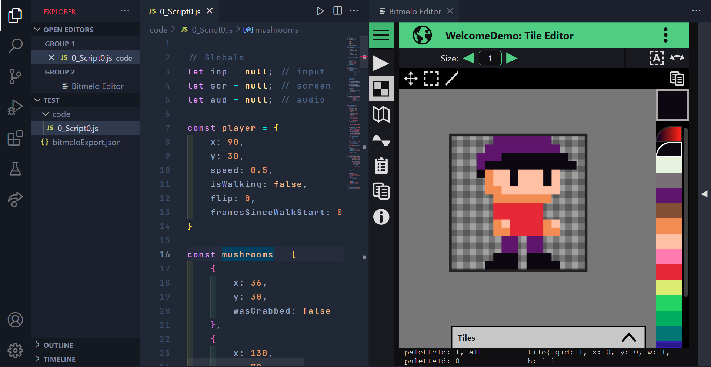
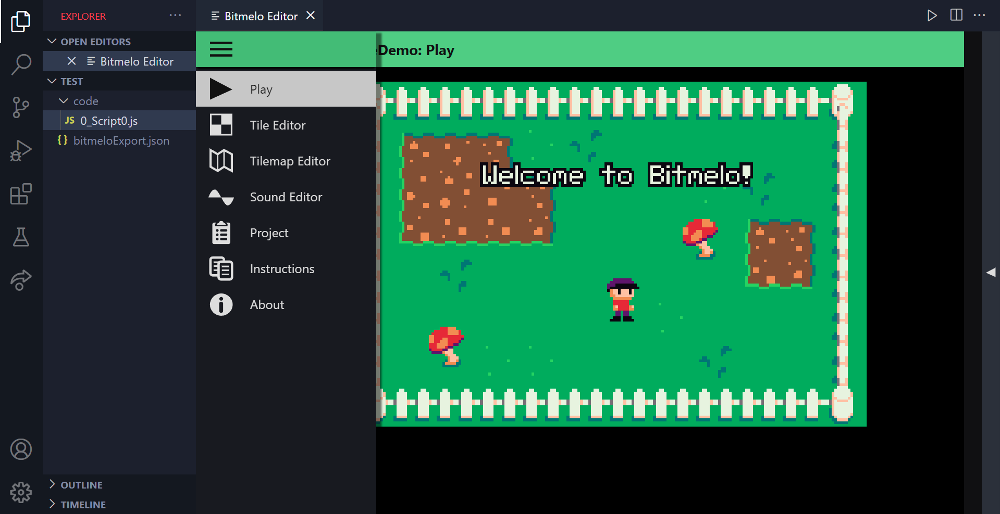

# bitmelo-editor-unofficial README

Make Bitmelo games in VS code. Use the art, sound and tilemap editors from Bitmelo. Work on your code in a real IDE and live share.

[Bitmelo Editor Offical README](./reactApp/README.md)

[Bitmelo Editor Licence](./reactApp/agpl.txt) (dual licensed, look at README)

---

## Screenshots

	
	

---

## What commands are added?
	>Initialize Bitmelo
	Create a new empty Bitmelo project in the editor, saves to local files

	>Open Bitmelo
	Reopen a local Bitmelo project in the editor

	>Sync Bitmelo
	Load all your code from VScode into a Bitmelo project

---

## How are your projects saved?
	.
	├──bitmeloExport.json      <-- All your project data, synced live
	└──code                    <-- Human readable code, can be synced with ">Sync Bitmelo"
		└──0_MyScript.js       <-- First script, named "MyScript"
		└──1_MyOtherScript.js  <-- Second script, named "MyOtherScript"

---

## Limitations
	Bitmelo code tab is removed: You are in VS code for a reason

	Bitmelo publish tab is removed: I don't want to deal with accounts, you can still export when you are done

	Live share only works with the VS code text editor: Using live share with Bitmelo editors will cause unintended behaviour. If only one person changes art/sound/tilemaps at a time everything is fine.

	You have to sync your code: When you are done writing code you must run ">Sync Bitmelo" to see changes.

	This may be a buggy mess I wrote in 3 days: Backup your "bitmeloExport.json" file often!

---

## Release Notes

### 1.0.0

- Initial release of bitmelo-editor-unofficial